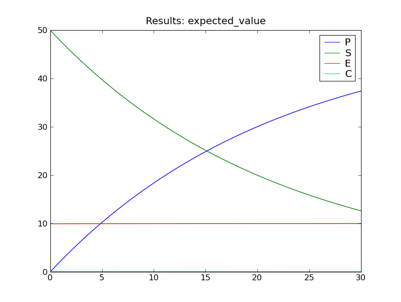
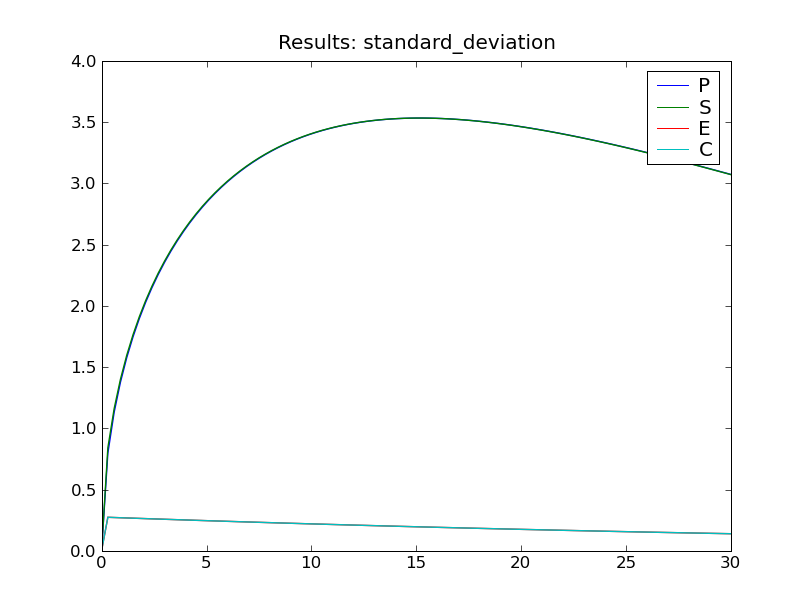
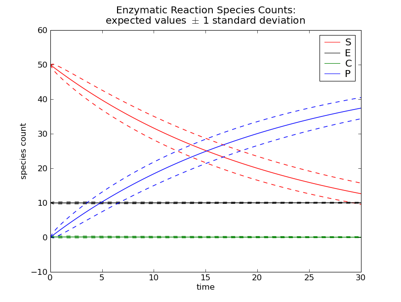

.. _example-enzyme-kinetics:

========================
Example: enzyme kinetics
========================
Consider the following simple enzymatic reaction:
:math:`S + E \leftrightarrow{} C \rightarrow{} P + E`.

In this system, the enzyme :math:`E` acts as a catalyst for the transformation
of the substrate :math:`S` into the product :math:`P`, via the complex
:math:`C`.

We can write this as a system of three reactions

.. math::
   
   S + E \xrightarrow[]{k_1} C \; ,
   
   C \xrightarrow[]{k_2} S + E \; ,
   
   C \xrightarrow[]{k_3} P + E \; ;

with kinetic parameters
:math:`k_1 = 0.01, k_2 = 35, k_3 = 30`
and initial copy counts
:math:`S_0 = 50, E_0 = 10, C_0 = 0, P_0 = 0`.

.. Note::
   This type of enzymatic reaction is commonly approximated by
   Michaelis-Menten kinetics. We will not employ the Michaelis-Menten
   approximation here, but instead solve the chemical master equation
   for the full system of reactions.

Defining the model
~~~~~~~~~~~~~~~~~~
We shall use species counts as the state space for this model.

.. _species-count-functions:

Species count functions
-----------------------
Let :math:`[S], [E], [C], [P]` denote the copy counts of the species
:math:`S, E, C, P`.

By considering conservation laws,
we obtain two constraints on the species counts:

.. math ::
    
    S_0 & = [S] + [C] + [P] \; ,\\
    E_0 & = [E] + [C] \; .

It is sufficient to track the copy counts of two of the species. We shall
track :math:`[S]` and :math:`[C]`.

Define :math:`x = (x_0, x_1) := ([S], [C]) \in \mathbb{N}^2`.
Then we can express the counts of all four species as functions of
:math:`x`: and the initial counts of :math:`S` and :math:`E`:

.. math ::

    [S] & = x_0 \; , \\
    [E] & = E_0 - x_1 \; , \\
    [C] & = x_1 \; , \\
    [P] & = S_0 - x_0 - x_1 \; .

We can translate this formulation quite naturally into Python code.
Let each state ``x`` in the state space be a tuple of length 2.
We shall define
``x[0]`` as :math:`[S]`, the copy count of the substrate, and
``x[1]`` as :math:`[C]`, the copy count of the complex.
We define four functions ``s``, ``e``, ``c``, ``p`` that take a
state ``x`` and return the corresponding species count::

    s_0 = 50
    e_0 = 10
    
    s = lambda *x : x[0]
    e = lambda *x : e_0 - x[1]
    c = lambda *x : x[1]
    p = lambda *x : s_0 - x[0] - x[1]

For example, to evaluate the copy count of the species :math:`P`, given
that there are 2 copies of :math:`S` and 3 copies of :math:`C`, we would
call the function ``p`` with the arguments 2 and 3, that is, ``p(2, 3)``.
This function call will return the integer ``45``
(recall :math:`S_0 = 50`, so :math:`[P] = S_0 - [S] - [C] = 50 - 2 - 3`).

Propensity functions
--------------------
We can express the propensity functions :math:`\nu_1, \nu_2, \nu_3` of the
three reactions in terms of the state :math:`([S], [C]) \in \mathbb{N}^2` :

.. math::
   
   \nu_1([S], [C]) := & k_1[S][E] \; , \\
   \nu_2([S], [C]) := & k_2[C] \; ,\\
   \nu_3([S], [C]) := & k_3[C] \; .

Equivalently, in Python we may define these propensity functions in terms
of our existing species count functions ``s``, ``e``, ``c`` and ``p``::

    propensities = (
        lambda *x : 0.01*s(*x)*e(*x),
        lambda *x : 35.0*c(*x),
        lambda *x : 30.0*c(*x),
    )

State transitions
-----------------
We must now define the state transitions associated with these three reactions.
Recall our chosen state representation is
:math:`(x_0, x_1) = ([S], [C]) \in \mathbb{N}^2`. The first
reaction :math:`S + E \xrightarrow[]{k_1} C` reduces the copy count of
:math:`S` by one, but increases the copy count of :math:`C` by one.
In :math:`(x_0, x_1)` coordinates, this corresponds to the transition:

.. math::

   (x_0, x_1) \mapsto & (x_0 - 1, x_1 + 1) = (x_0, x_1) + (-1, 1) \; .

We represent this transition in Python code as the tuple ``(-1, 1)``.

Since the second reaction is the inverse of the first reaction, the transition
for the second reaction :math:`C \xrightarrow[]{k_2} S + E`
is the negation (i.e. the additive inverse)
of the transition for the first reaction, that is, ``(1, -1)``.

The transition for the third reaction :math:`C \xrightarrow[]{k_3} P + E`
is ``(0, -1)``, as this reaction consumes one copy of :math:`C`, and neither
produces nor consumes :math:`S`.

.. Note::
   Although the three reactions also modify the copy counts of the species
   :math:`E` and :math:`P`, these modifications do not need to be
   *explicitly* accounted for by the transitions. The transitions only need
   to contain the change in species counts for those species in the state space.

We define a tuple named ``transitions`` which contains the transitions for all
three reactions, using the same ordering as the ``propensities`` tuple
containing the propensity functions::

    transitions = (
        (-1, 1),
        (1, -1),
        (0, -1)
    )

Creating the model
------------------
By combining the species count functions with the propensity functions
and the transitions we may construct a model ``m``::

    from cmepy import model

    s_0 = 50
    e_0 = 10
    
    # species count function definitions
    s = lambda *x : x[0]
    e = lambda *x : e_0 - x[1]
    c = lambda *x : x[1]
    p = lambda *x : s_0 - x[0] - x[1]
    
    # model definition, in terms of species count functions
    m = model.create(
        species_counts = (s, e, c, p, ),
        propensities = (
            lambda *x : 0.01*s(*x)*e(*x),
            lambda *x : 35.0*c(*x),
            lambda *x : 30.0*c(*x),
        ),
        transitions = (
            (-1, 1),
            (1, -1),
            (0, -1)
        ),
    )

Observe that the propensity functions and state transitions for the reactions
are passed as keyword arguments to ``model.create``, using the keywords
``propensities`` and ``transitions`` respectively. Note also that we have
also passed a tuple containing the species count functions ``s``, ``e``, ``c``
and ``p`` as the keyword argument ``species_count``.

Finishing touches
-----------------
To complete the model, we will add additional keyword arguments
``shape``, ``initial_state``, ``name``, ``species`` and ``reactions``.
These first two initial arguments control the extent of the state space,
and the initial state of the probability distribution, while the latter
three arguments are used to define names (as strings) for the model,
the species, and the reactions, respectively.

We need to specify the shape of the state space for our model ``m``.
Recall states in our state space have the form
:math:`x = ([S], [C]) \in \mathbb{N}^2`. Recall also the constraints mentioned
earlier in the :ref:`species-count-functions` section. It follows that
:math:`0 \leq [S] \leq S_0`, while :math:`0 \leq [C] \leq \min{}\{E_0, S_0\}`.
Therefore, the tuple of upper bounds for state space coordinates is
:math:`(S_0, \min{}\{E_0, S_0\})`. In Python, the corresponding minimal
*exclusive* upper bound is the tuple ``(s_0 + 1, min(e_0, s_0) + 1)``.
This is the value we use for the shape of our state space.

We also need to specify the initial state for our model. Recall that
:math:`S_0 = 50` and :math:`E_0 = 10`, while :math:`C_0 = P_0 = 0`.
In :math:`([S], [C])` coordinates, these initial values are the state
:math:`(S_0, E_0)`. Therefore we set ``initial_state = (s_0, e_0)``.

The values of the ``name``, ``species`` and ``reactions`` arguments are all
straight-forward.

.. literalinclude:: examples/enzyme_reaction.py

Now, the above model definition includes one unexplained touch : 
the use of the ``non_neg`` function from ``cmepy.util``.

Recall the definition of the species count function
``p = lambda *x : s_0 - x[0] - x[1]``.
If ``a + b > s_0``, then ``p(a, b) < 0``, that is, ``p`` returns a negative
integer for the species count of :math:`P`. Yuck!
Of course, this will only happen for nonsensical values of the copy count
``a`` of :math:`S`, and the copy count ``b`` of :math:`C`.
To avoid issues arising with negative species
counts, we can simply ensure the species count function ``p`` is defined to be
zero for nonsensical inputs. We achieve this by using the ``non_neg`` function,
which acts more-or-less as follows:

.. math::

    \textrm{non\_neg}(x) :=
    \begin{cases} x : \textrm{if $x \geq 0$} \\
    0 : \textrm{otherwise}
    \end{cases}

Using this ``non_neg`` function, we have modified our existing definitions of
the species count functions ``e`` and ``p`` to read::

    e = lambda *x : non_neg(e_0 - x[1])
    p = lambda *x : non_neg(s_0 - x[0] - x[1])

.. Note::
    The actual implementation of the ``non_neg`` function in Python is somewhat
    subtle. The 'obvious' definition is to let::
    
       non_neg = lambda x : max(x, 0)
    
    Unfortunately, this is wrong!
    The reason why this definition is unsatisfactory is that it only works
    for scalar arguments ``x``.
    
    CmePy relies upon the species count and propensity functions also being
    well behaved for vectorised inputs, in order to make efficient use of
    the underlying :mod:`numpy` array operations. Because of this, ``non_neg``
    is defined in terms of ``numpy.maximum``, which acts exactly like
    the built-in Python ``max`` function, except it is well behaved if one or
    more of its arguments is a (multi-dimensional) array. In contrast,
    attempting to pass arrays as arguments to the built-in ``max`` function
    will raise an exception.

Solving the model and plotting results
~~~~~~~~~~~~~~~~~~~~~~~~~~~~~~~~~~~~~~
Defining the model for this enzyme kinetics system is quite a lot of work.
Thankfully, once we have the model correctly defined, it is easy to solve
the model and obtain results using CmePy.

First, create a solver instance to solve the enzymatic reaction model::
    
    from cmepy import solver
    
    enzyme_solver = solver.create(
        model = m,
        sink = False
    )

For this model, all reachable system states are included in the model's
state space, therefore we do not require a 'sink' state to store 
probability that leaks from the state space.

Second, create a recorder instance to record the solutions generated by the
solver::

    from cmepy import recorder
    
    species = ['S', 'E', 'C', 'P']
    
    r = recorder.create(
        (species, m.species_counts)
    )

The arguments to :func:`recorder.create` are used to define a group of random
variables for the species counts. The list of strings ``species``
defines the names of the variables, while ``m.species_counts`` defines the
functions used to map states in the state space to states of these species
count random variables. Recall ``m.species_counts`` is just the tuple of
species count functions that we created earlier when defining the model ``m``.

Third, advance the solution by stepping the solver, while writing the solutions
to the recorder::

    import numpy
    
    time_steps = numpy.linspace(0.0, 30.0, 101)
    
    for t in time_steps:
        enzyme_solver.step(t)
        r.write(t, enzyme_solver.y)  

The fourth and final step is to do something with the results. One easy way to
produce some graphs of the expected values and standard deviations is via the
function :func:`cmepy.recorder.display_plots`::

    recorder.display_plots(r)

This call displays the following two plots using the :mod:`matplotlib` package:

On the other hand, we can use :mod:`matplotlib`'s :mod:`pylab` interface
directly, to create some customised plots. To see an example of this,
replace the ``recorder.display_plots(r)`` statement with the following code::

    import pylab
    
    species_colours = {
        'S' : 'r',
        'E' : 'k',
        'C' : 'g',
        'P' : 'b',
    }
    
    pylab.figure()
    for var in species:
        colour = species_colours[var]
        measurement = r[var]
        
        mu = numpy.reshape(numpy.array(measurement.expected_value), (-1, ))
        sigma = numpy.array(measurement.standard_deviation)
        
        mu_style = '-'+colour
        mu_pm_sigma_style = '--'+colour
        pylab.plot(measurement.times, mu, mu_style, label = var)
        pylab.plot(measurement.times, mu + sigma, mu_pm_sigma_style)
        pylab.plot(measurement.times, mu - sigma, mu_pm_sigma_style)
    
    title_lines = (
        'Enzymatic Reaction Species Counts:',
        'expected values $\pm$ 1 standard deviation',
    )
    pylab.title('\n'.join(title_lines))
    pylab.xlabel('time')
    pylab.ylabel('species count')
    pylab.legend()
    pylab.show()

Observe that we access the measurement for the random variable named ``var``
from the recorder ``r`` using ``measurement = r[var]``, then access lists of
the measurement times, expected values, and standard deviations, via
``measurement.times``, ``measurement.expected_value`` and
``measurement.standard_deviation``, respectively. In order to perform
element-wise addition and subtraction operations between the expected value
and standard deviation measurements, we transform them to arrays via
:func:`numpy.array`.

.. Note::
   Each expected value measurement computed by the recorder is in fact a
   *tuple*.
   This means that ``numpy.array(measurement.expected_value)`` is an array of
   shape ``(101, 1)``, since ``101`` is the number of times we called 
   the ``r.write(t, s.y)``. We reshape this expected value array to have the
   shape ``(101, )``, which is the shape of the standard deviation array
   ``numpy.array(measurement.standard_deviation)``, ``(101, )``.

When run, this code generates the following plot:

Note that :mod:`matplotlib` renders the inline Latex math markup
``$\pm$`` included in the title as the symbol :math:`\pm`.
