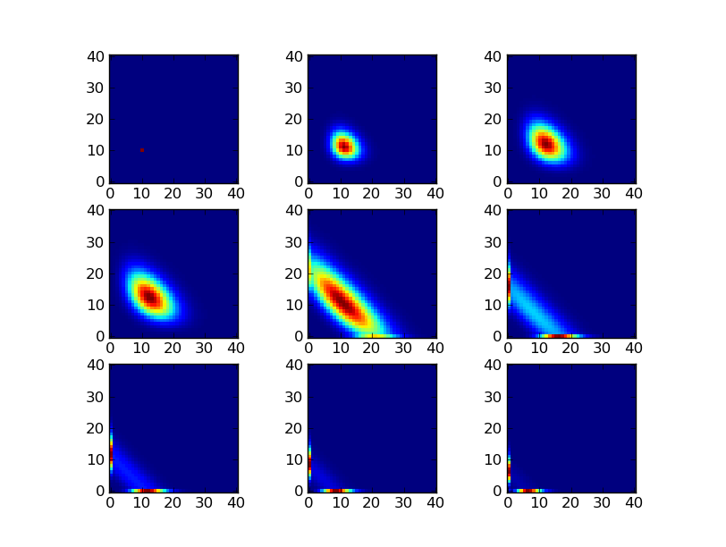
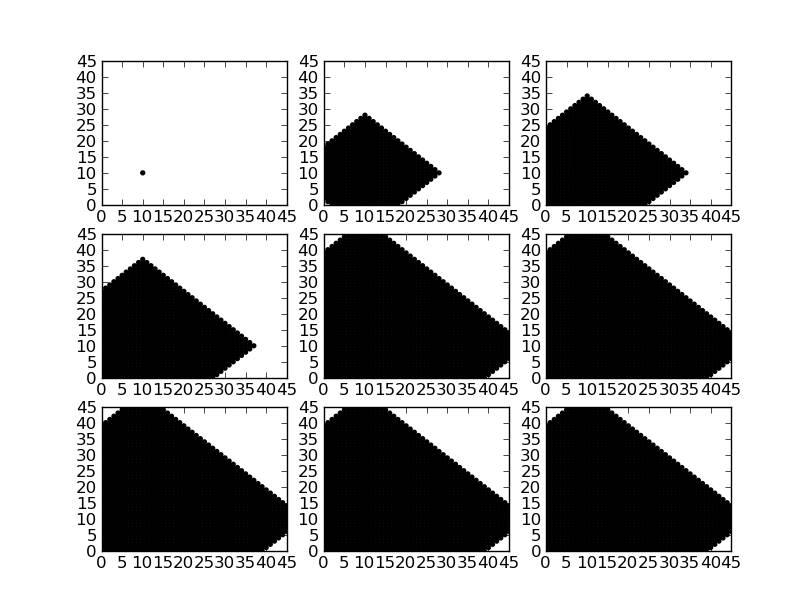

================================
FSP example 1 : simple expansion
================================

Overview
--------

This example demonstrates an FSP solver with a very simple expansion strategy.
In order to expand the domain, the domain is simply grown by adding all states
reachable by making a sequence of state transitions, up to some maximum depth.
This simple strategy leads to very large state spaces, but it works fine for
the burr08 model, as it is a two-dimensional model with a limited number of
states.

This simple expansion strategy is implemented by the module
:mod:`cmepy.fsp.simple_expander` as follows:

.. literalinclude:: ../../cmepy/fsp/simple_expander.py

Output
------

Source
------

.. literalinclude:: ../../examples/fsp_example_1_simple_expansion.py
