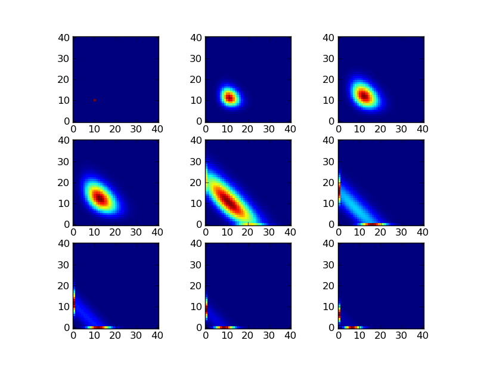
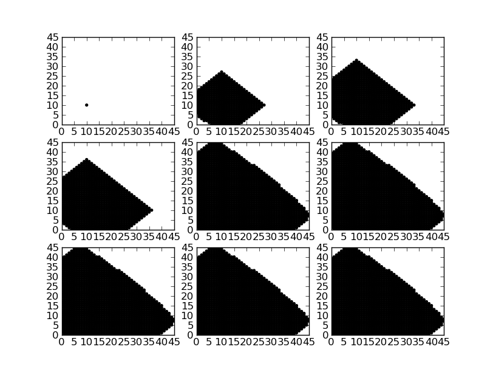

=================================
FSP example 2 : support expansion
=================================

Overview
--------

This example demonstrates an FSP solver with a more complicated expansion
strategy. Instead of expanding the entire domain, this expansion strategy
expands states about the support of the solution. The solution is slightly
compressed before computing its support in order to trim states with very
low probability where possible. The states expanded about the support are
then added to the domain of the FSP solver.

This expansion strategy requires more computation but leads to smaller
domains. Smaller domains become especially important for higher
dimensional models.

This support expansion strategy is implemented by the module
:mod:`cmepy.fsp.support_expander` as follows:

.. literalinclude:: ../../cmepy/fsp/support_expander.py

Output
------

Source
------

.. literalinclude:: ../../examples/fsp_example_2_support_expansion.py
