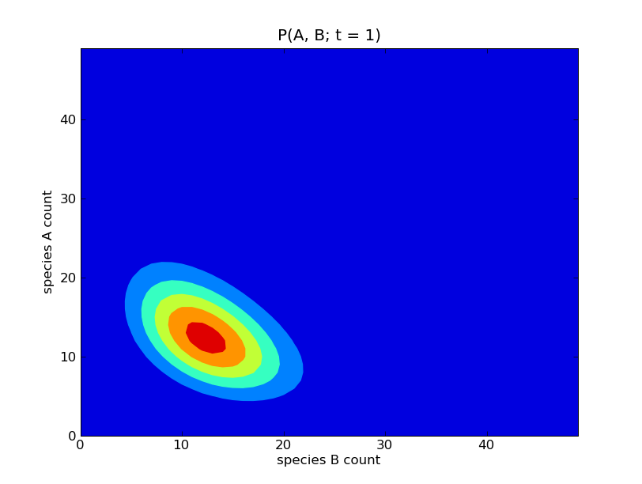
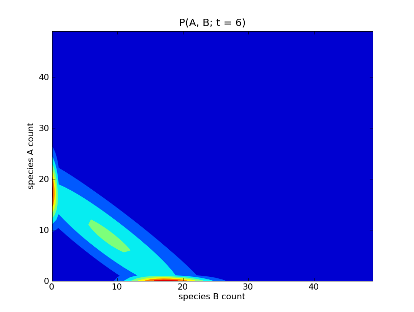

========================================
:mod:`burr08` : two competing clonotypes
========================================

Overview
~~~~~~~~

This model defines a system of reactions

.. math::

    \star \xrightarrow{} A \xrightarrow{} \; ,
    
    \star \xrightarrow{} B \xrightarrow{} \; ;

where the initial copy counts of the species :math:`A` and :math:`B` are
both zero. The reaction propensities used for the two 'birth' reactions
:math:`\star \xrightarrow{} A` and :math:`\star \xrightarrow{} B` are
non-standard. The propensity for the former reaction is time-dependent,
and is defined as

.. math::

   60 e^{-0.1 t} [A]
   \left( \frac{0.5}{[A] + [B]} + \frac{0.5}{[A] + 1000}\right)

while the propensity for the latter reaction is the same, with the species
counts :math:`[A]` and :math:`[B]` swapped. The two 'death' reactions
are elementary and occur with propensities of :math:`1`.

Running the model
~~~~~~~~~~~~~~~~~

This model is defined by the module
`cmepy/model/burr08.py
<http://github.com/fcostin/cmepy/blob/master/cmepy/models/burr08.py>`_.
To see this model in action, fire up the Python interpreter, and enter:

    >>> from cmepy.models import burr08
    >>> burr08.main()

This will produce a sequence of plots of the probability distributions
:math:`P([A], [B]; t)` for :math:`t = 0, 1, \ldots, 15`. Some of these
plots are show below.

Sample results
~~~~~~~~~~~~~~

   
.. image:: burr08_plot_t13.png
   :scale: 100
