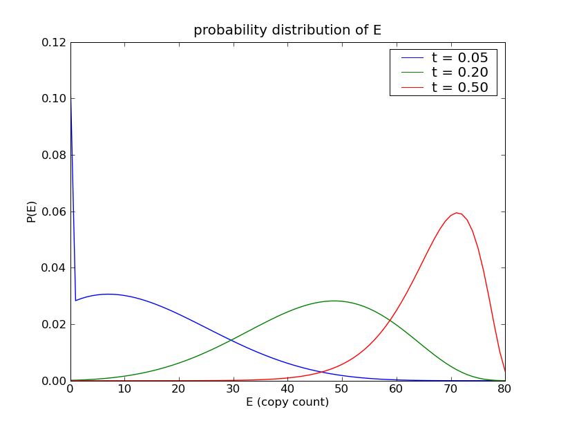

=========================
:mod:`catalytic_reaction`
=========================

Overview
~~~~~~~~
This model defines the following 'catalytic reacion' system:

.. math::

    A & \xrightarrow{k_1} B \; , \\
    B & \xrightarrow{k_2} C \; , \\
    B + D & \xrightarrow{k_3} B + E \; .
    
Here, the species :math:`B` acts as a catalyst for the third
reaction. The rate constants are
:math:`k_1 = 1`, :math:`k_2 = 1000` and :math:`k_3 = 100`,
while the initial species counts are
:math:`A = 50`, :math:`D = 80` and :math:`B = C = E = 0`.

This catalytic reaction system is taken from the paper by
Mastny, Haseltine, Rawlings [MHR07]_ .

Running the model
~~~~~~~~~~~~~~~~~
This model is defined by the module :mod:`cmepy.model.catalytic_reaction`.
The source code for this model is listed below.

The model solves the distribution over a sparse, truncated state space.
For more information, see :ref:`sparse-state-spaces`.

To run this model, open the Python interpreter, and enter:

    >>> from cmepy.models import catalytic_reaction
    >>> catalytic_reaction.main()

This will solve the model and then produce the following plot, illustrating
the marginal distribution of species count of :math:`E` at the times
:math:`t = 0.05, 0.2, 0.5` .

Sample results
~~~~~~~~~~~~~~

Source
~~~~~~

.. literalinclude:: ../../cmepy/models/catalytic_reaction.py

.. rubric:: References
.. [MHR07]
   `Mastny, E.A., Haseltine, E.L. and Rawlings, J.B.,
   Two classes of quasi-steady-state model reductions for stochastic kinetics,
   Journal of Chemical Physics (2007),
   Vol 127.
   <http://scholar.google.com/scholar
   ?q=Mastny+Haseltine+Rawlings+two+classes+of+quasi-steady-state+model+
   reductions+for+stochastic+kinetics>`_
   
   
