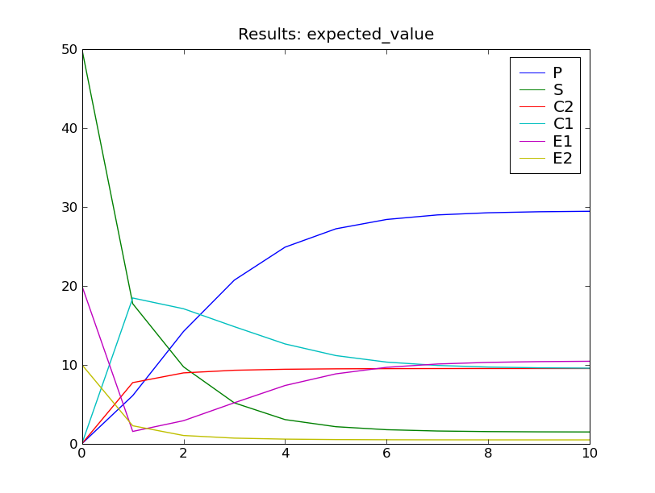
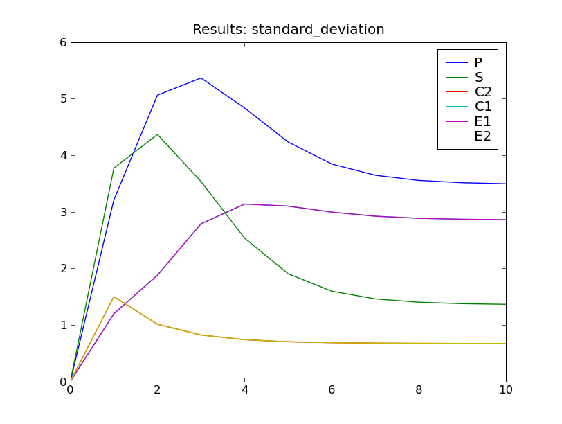

===================================================
:mod:`dual_enzymatic` : coupled enzymatic reactions
===================================================

Overview
~~~~~~~~
This model describes a system of coupled enzymatic reactions. The reactions
composing this system are as follows:

.. math::
   
   S + E_1 & \xrightarrow{k_1} C_1 \; , \\
   C_1 & \xrightarrow{k_2} S + E_1 \; , \\
   C_1 & \xrightarrow{k_3} P + E_1 \; , \\
   
   P + E_2 & \xrightarrow{k_1} C_2 \; , \\
   C_2 & \xrightarrow{k_2} P + E_2 \; , \\
   C_2 & \xrightarrow{k_3} S + E_2 \; ;

The rate constants are :math:`k_1 = 4, k_2 = 5` and :math:`k_3 = 1`.
The initial species counts are 50 copies of :math:`S`, 20 copies of :math:`E_1`,
and 10 copies of :math:`E_2`. The other species counts are initially zero.

The first three reactions in the system describe an
enzymatic reaction transforming the species :math:`S` into the species
:math:`P`. The second three reactions describe another enzymatic reaction
transforming the species :math:`P` back into :math:`S`.

Running the model
~~~~~~~~~~~~~~~~~
This model is defined by the module :mod:`cmepy.model.dual_enzymatic`.
The source code for this model is listed below.

To try out this model, open the Python interpreter and enter:

    >>> from cmepy.models import dual_enzymatic
    >>> dual_enzymatic.main()

This will solve the system up to :math:`t = 10`, then display plots of the
standard deviation and expected value of the species counts, as seen below.

Sample results
~~~~~~~~~~~~~~

.. _source-code-dual-enzymatic:

Source code
~~~~~~~~~~~
.. literalinclude:: ../../cmepy/models/dual_enzymatic.py
