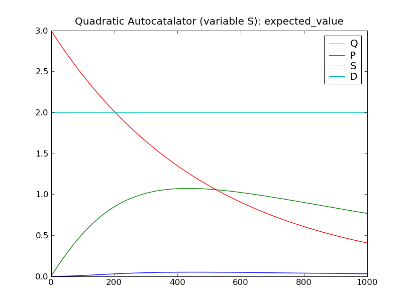
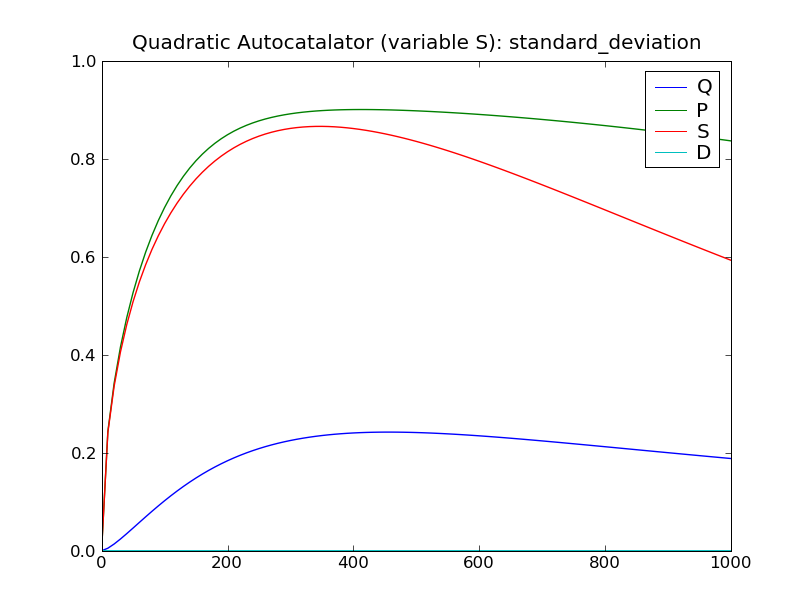

====================================================================
:mod:`gou07` : unidirection dimerisation and quadratic autocatalator
====================================================================

Overview
~~~~~~~~
The :mod:`cmepy.models.gou07` modules defines two models of systems given as
examples by Goutsias [GOU07]_ .

The first model is a unidirectional dimerisation model, which consists of the
single reaction:

.. math::

   P + Q \xrightarrow{k} PQ

The rate coefficient for this reaction is :math:`k = 0.001`. Initially there
are 10 copies of both species :math:`P` and :math:`Q`.

This model can be used in CmePy as follows::

    from cmepy.models import gou07
    
    model = gou07.create_model_uni_dim()

The second model defined by this module is called the quadratic autocatalator,
and is a system of six reactions:

.. math::
   
   S \xrightarrow{k_1} P \\
   D + P \xrightarrow{k_2} D + 2P \\
   P + P \xrightarrow{k_3} P + Q \\
   P + Q \xrightarrow{k_4} 2Q \\
   P \xrightarrow{k_5} \star \\
   Q \xrightarrow{k_6} \star

The rate coefficients of these reactions are
:math:`k_1 = 0.002`,
:math:`k_2 = 0.001`,
:math:`k_3 = 0.005`,
:math:`k_4 = 0.004`,
:math:`k_5 = 0.002` and
:math:`k_6 = 0.050`,
while the initial copy counts are 3 copies of the species :math:`S`
and zero copies of all other species.

This model can be used in CmePy as follows::

    from cmepy.models import gou07
    
    model = gou07.create_model_quad_autocat()

.. Note::
   
   Goutsias [GOU07]_ actually assumes that the copy count of the species
   :math:`S` used in the above model is in fact *constant*, so that the first
   reaction :math:`S \xrightarrow{k_1} P` proceeds with a fixed propensity.
   
   This behaviour can be enabled by passing the keyword argument
   ``fixed_s = True`` when calling the
   :func:`create_model_quad_autocat` function to create the quadratic
   autocatalator model.
   
Running the model
~~~~~~~~~~~~~~~~~
The source code for these models is listed below.

The function :func:`main` defined in the module :mod:`cmepy.models.gou07`
solves the quadratic autocatalator model.
To run this function, open the Python interpreter and enter:

    >>> from cmepy.models import gou07
    >>> gou07.main()

This will solve the system up to :math:`t = 1000`, over 100 steps,
then display plots of the standard deviation and expected value of the
species counts, as seen below.

Sample results
~~~~~~~~~~~~~~

Source
~~~~~~
.. literalinclude:: ../../cmepy/models/gou07.py

.. rubric:: References
.. [GOU07]
   `Goutsias, J.,
   Classical versus stochastic kinetics modeling of biochemical reaction systems,
   Biophysical Journal (2007),
   Vol 92, pp. 2350--2365.
   <http://scholar.google.com/scholar
   &q=goutsias+2007+classical+versus+stochastic+kinetics+modeling+
   of+biochemical+reaction+systems>`_
