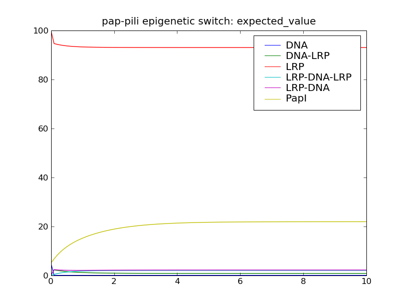
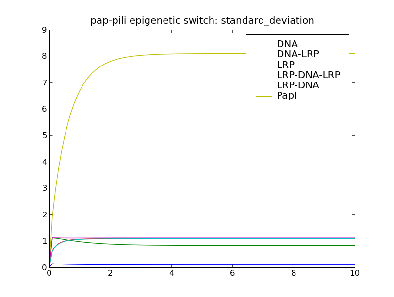

============================================
:mod:`pap_pili` : pap-pili epigenetic switch
============================================

Overview
~~~~~~~~
The module :mod:`cmepy.models.pap_pili` defines a model of the
pap-pili epigenetic switch system from Munksy and Khammash [MK06]_.

This system consists of 10 reactions:

.. math::
   
   \textrm{LRP} + \textrm{DNA} & \xrightarrow{} \textrm{LRP-DNA} \; , \\
   \textrm{LRP-DNA} & \xrightarrow{} \textrm{LRP} + \textrm{DNA} \; , \\
   \textrm{DNA} + \textrm{LRP} & \xrightarrow{} \textrm{DNA-LRP} \; , \\
   \textrm{DNA-LRP} & \xrightarrow{} \textrm{DNA} + \textrm{LRP} \; , \\
   \textrm{LRP-DNA} + \textrm{LRP} & \xrightarrow{} \textrm{LRP-DNA-LRP} \; , \\
   \textrm{LRP-DNA-LRP} & \xrightarrow{} \textrm{LRP-DNA} + \textrm{LRP} \; , \\
   \textrm{LRP} + \textrm{DNA-LRP} & \xrightarrow{} \textrm{LRP-DNA-LRP} \; , \\
   \textrm{LRP-DNA-LRP} & \xrightarrow{} \textrm{LRP} + \textrm{DNA-LRP} \; , \\
   \star & \xrightarrow{} \textrm{PapI} \; , \\
   \textrm{PapI} & \xrightarrow{} \star \; .

The propensities of many of these reactions are non-elementary: the production
of PapI is catalysed by LRP-DNA, while the propensities of the four reactions

.. math::
   
   \textrm{LRP-DNA} & \xrightarrow{} \textrm{LRP} + \textrm{DNA} \; , \\
   \textrm{DNA-LRP} & \xrightarrow{} \textrm{DNA} + \textrm{LRP} \; , \\
   \textrm{LRP-DNA-LRP} & \xrightarrow{} \textrm{LRP-DNA} + \textrm{LRP} \; , \\
   \textrm{LRP-DNA-LRP} & \xrightarrow{} \textrm{LRP} + \textrm{DNA-LRP} \; ,

that is, the reactions where LRP unbinds from DNA,
are all multiplied by the factor :math:`\frac{r}{1+r}`, where :math:`r` denotes
the copy count of the PapI species.

For the grim details of the reaction propensity functions and rate
constants, either inspect the source code (see below) or refer to Munksy and
Khammash  [MK06]_.

Running the model
~~~~~~~~~~~~~~~~~
To solve this model in CmePy and plot some results, simply open the Python
interpreter and type::

    >>> from cmepy.models import pap_pili
    >>> pap_pili.main()

This creates the pap-pili epigentic switch model with 5 initial copies of DNA,
5 initial copies of PapI, 100 initial copies of LRP, and zero initial copies
of all other species. The model is solved from :math:`t = 0` to :math:`t = 10`
using 100 equally-spaced time steps.

After solving the model, this script will display the following plots:

Sample results
~~~~~~~~~~~~~~

Source
~~~~~~
.. literalinclude:: ../../cmepy/models/pap_pili.py

.. rubric:: References
.. [MK06]
   `Munsky, B. and Khammash, M.,
   The finite state projection algorithm for the solution of the
   chemical master equation,
   Journal of Chemical Physics (2006),
   Vol 124.
   <http://scholar.google.com/scholar
   ?q=Munsky+Khammash+the+finite+state+projection+algorithm+for+the+solution+
   of+the+chemical+master+equation>`_
