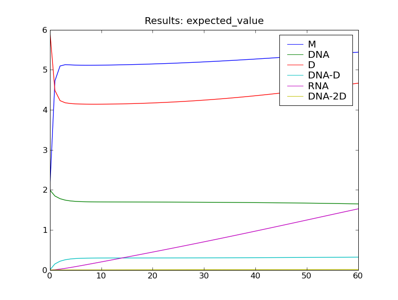
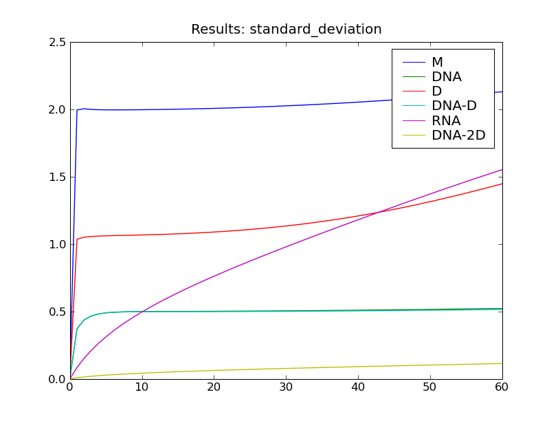

=========================================================================
:mod:`transcription_regulation` : time dependent transcription regulation
=========================================================================

Overview
~~~~~~~~
The module :mod:`cmepy.models.transcription_regulation` defines a model
of the transcription regulation system. This transcription regulation system
was formulated by
Goutsias [GOU05]_, and consists of 10 reactions:

.. math::
   
   \textrm{RNA} &\xrightarrow{} \textrm{RNA} + \textrm{M} \; , \\
   \textrm{M} & \xrightarrow{} \star \; , \\
   \textrm{DNA-D} &\xrightarrow{} \textrm{RNA} + \textrm{DNA-D} \; , \\
   \textrm{RNA} & \xrightarrow{} \star \; , \\
   \textrm{DNA} + \textrm{D} &\xrightarrow{} \textrm{DNA-D} \; , \\
   \textrm{DNA-D} &\xrightarrow{} \textrm{DNA} + \textrm{D} \; , \\
   \textrm{DNA-D} + \textrm{D} &\xrightarrow{} \textrm{DNA-2D} \; , \\
   \textrm{DNA-2D} &\xrightarrow{} \textrm{DNA-D} + \textrm{D} \; , \\
   \textrm{M} + \textrm{M} &\xrightarrow{} \textrm{D} \; , \\
   \textrm{D} &\xrightarrow{} \textrm{M} + \textrm{M}\; . \\

Initially, the system has 2 copies of DNA, 2 copies of M, and 6 copies of D.

The propensity functions of these reactions are all elementary. See the source
code below or Goutsias [GOU05]_ for the rate coefficients. However, the
three reactions

.. math::

   \textrm{DNA} + \textrm{D} &\xrightarrow{} \textrm{DNA-D} \; , \\
   \textrm{DNA-D} + \textrm{D} &\xrightarrow{} \textrm{DNA-2D} \; , \\
   \textrm{M} + \textrm{M} &\xrightarrow{} \textrm{D} \; , \\

that is, those reactions in the system involving the combination of two
different molecules, have their propensities scaled by a
time dependent factor :math:`\phi(t)`, where

.. math::

   \phi(t) = e^{ - (t/T) \cdot \log{} 2 } \; .

Here, the constant :math:`T` is set to 35 minutes. See Goutsias [GOU05]_ for
further details.

Running the model
~~~~~~~~~~~~~~~~~
To solve this model in CmePy and plot some results, simply open the Python
interpreter and type::

    >>> from cmepy.models import transcription_regulation
    >>> transcription_regulation.main()

The model is solved from :math:`t = 0` to :math:`t = 60`
using 60 equally-spaced time steps. The model is solved using a truncated state
space, but the state space truncation error is still less than 1 percent of
the total probability at the final time :math:`t = 60`.

After solving the model, this script will display the the plots shown below.

Sample results
~~~~~~~~~~~~~~

Source
~~~~~~
.. literalinclude:: ../../cmepy/models/transcription_regulation.py

.. rubric:: References
.. [GOU05]
   `Goutsias, J.,
   Quasiequilibrium approximation of fast reaction
   kinetics in stochastic biochemical systems,
   Journal of Chemical Physics (2005),
   Vol 122.
   <http://scholar.google.com/scholar
   ?q=Goutsias+quasiequilibrium+approximation+of+fast+reaction+
   kinetics+in+stochastic+biochemical+systems>`_
