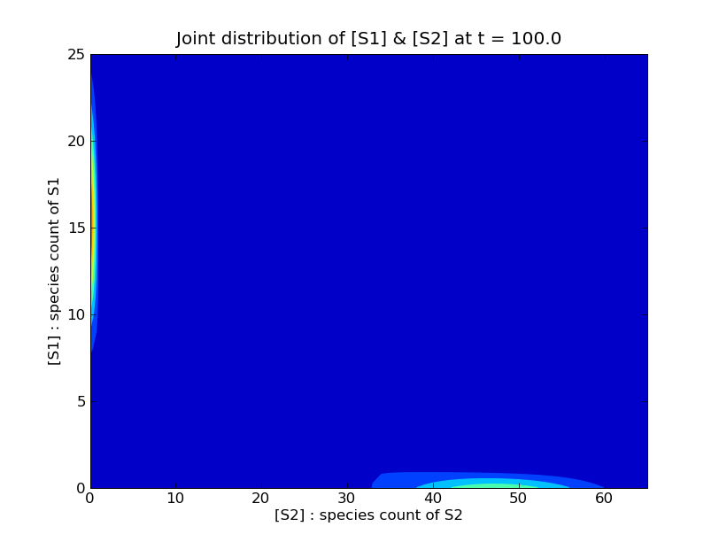

.. _sparse-state-spaces:

===================
Sparse state spaces
===================

The :func:`cmepy.solver.create` function accepts the optional keyword argument
``domain_states``.
By default, if no ``domain_states`` argument is given,
CmePy generates a dense 'rectangular' state space with dimensions specified by
``m.shape``, where ``m`` is the value of the ``model`` argument passed to
:func:`cmepy.solver.create`.

However, often it is far more efficient to specify sparse state spaces.
The :mod:`cmepy.domain` module provides a number of utility routines to ease
the construction of sparse state spaces. The most important one is the
:func:`from_iter` function:

.. autofunction:: cmepy.domain.from_iter

Provided we have a suitable ``state_iter``, we can create a solver using the
sparse state space defined by ``state_iter`` as follows::
    
    from cmepy import domain, model, solver
    
    m = model.create(
        ... # model definition goes here
    )
    
    state_iter = ... # create state_iter somehow
    
    s = solver.create(
        model = m,
        sink = True,
        domain_states = domain.from_iter(state_iter)
    )

But what is a 'state iterator'? A state iterator is simply any iterable object
-- such as a list, a set, a dictionary or a generator expression --
that contains states. The states provided by the state iterator
are assumed to be length-:math:`d` tuples of integers, for some fixed integer
:math:`d \geq 1`.

Example: sparse state space for a mono-molecular system 
~~~~~~~~~~~~~~~~~~~~~~~~~~~~~~~~~~~~~~~~~~~~~~~~~~~~~~~
For a concrete example, consider the following mono-molecular
system of reactions:

.. math::

    A \xrightarrow{k_1} B \xrightarrow{k_2} C \xrightarrow{k_3} \star \; ,

where :math:`k_1, k_2, k_3` are all positive constants,
and the initial copy counts are :math:`A_0 = n, B_0 = 0, C_0 = 0`, for
some positive integer :math:`n`.

.. Note::
   Here, :math:`C \xrightarrow{} \star` is used to
   denote a 'pure decay' reaction. This reaction consumes the species :math:`C`
   and produces *nothing*, which is denoted :math:`\star`.
   If this seems distasteful, another interpretation is to simply assume that
   the reaction in fact transforms :math:`C` into some product which we ignore.

Let's consider a reaction count state space for this model. Let each
state :math:`x = (x_0, x_1, x_2)` be a triple of non-negative integers,
where :math:`x_0, x_1` and :math:`x_2` denote the counts of the reactions
:math:`A \xrightarrow{} B`, :math:`B \xrightarrow{} C` and
:math:`C \xrightarrow{} \star` respectively.

Since the third reaction may only occur following the second reaction, which
in turn may only occur after the first reaction, which can occur up to
:math:`n` times, the state space :math:`\Omega \subset \mathbb{N}^3` is
defined as:

.. math::
   \Omega := 
   \left\{ (x_0, x_1, x_2) \; : \; (x_0, x_1, x_2) \in \mathbb{N}^3
   \;, \; 0 \leq x_2 \leq x_1 \leq x_0 \leq n \right\}

We can define a generator in Python to yield precisely
these states::

    def gen_states(n):
        for x_0 in xrange(n + 1):
            for x_1 in xrange(x_0 + 1):
                for x_2 in xrange(x_1 + 1):
                    yield (x_0, x_1, x_2)
        return
    
We call the generator with some chosen value for the initial copy
count :math:`n` of the species :math:`A`, say :math:`n = 25`,
then pass the result as the ``domain_states``
keyword argument when creating the solver,
after transformation via the function :func:`domain.from_iter`::    
    
    s = solver.create(
        model = m,
        sink = True,
        domain_states = domain.from_iter(gen_states(25))
    )

.. _sparse-state-space-gene-toggle-example:

Example: sparse state space for Gardner's gene toggle model
~~~~~~~~~~~~~~~~~~~~~~~~~~~~~~~~~~~~~~~~~~~~~~~~~~~~~~~~~~~
Consider the following system, consisting of the two imaginatively-named
species :math:`S1` and :math:`S2` : 

.. math::
   :nowrap:
   
   \begin{align*}
   \textrm{reaction} &&
   \textrm{transition} &&
   \textrm{propensity} \\   
   \textrm{production of $S1$} &&   
   \star \xrightarrow{} S1 &&
   \frac{16}{1 + [S2]} \\
   \textrm{production of $S2$} &&
   \star \xrightarrow{} S2 &&
   \frac{16}{1 + [S1]^{2.5}} \\
   \textrm{decay of $S1$} &&
   S1 \xrightarrow{} \star &&
   [S1] \\
   \textrm{decay of $S2$} &&
   S2 \xrightarrow{} \star &&
   [S2]
   \end{align*}

The initial copy counts are zero copies of both :math:`S1`
and :math:`S2`.

This system is Munsky & Khammash's formulation of Gardner's gene toggle
[GCC00]_, [MK08]_.
The two species :math:`S1` and :math:`S2` *compete*:
copies of :math:`S1` inhibit the production of :math:`S2`, while conversely,
copies of :math:`S2` inhibit the production of :math:`S1`. The solution of the
chemical master equation for this system after :math:`t = 100` seconds
illustrates the result of these competetive dynamics:

Since most of the probability is concentrated around the axes, we can
still obtain a good approximation to the solution of the CME by only
considering the states near each axis.
We create a state space from the union of two rectangular regions
about the axes as follows::
    
    from cmepy import domain
    
    r_a = (66, 6)
    r_b = (10, 26)
    states_a = set(domain.to_iter(domain.from_rect(r_a)))
    states_b = set(domain.to_iter(domain.from_rect(r_b)))
    states = domain.from_iter(states_a | states_b)

The function :func:`domain.from_rect` transforms the given shapes ``r_a`` and
``r_b`` to arrays containing all the states in the corresponding rectangular
regions. We then contruct sets containing these states, using the 
function :func:`domain.to_iter` to create state iterators over the given
state arrays. Finally, we union the two sets ``states_a`` and ``states_b`` via
``states_a | states_b``, which is equivalent to ``states_a.union(states_b)``,
then transform the resulting set to a state array by applying the function
:func:`domain.from_iter`.

.. rubric:: References
.. [GCC00]
   `Gardner, T.S. and Cantor, C.R. and Collins, J.J.,
   Construction of a genetic toggle switch in Escherichia coli,
   Nature (2000),
   volume 403, pp. 339 -- 342.
   <http://scholar.google.com/scholar
   ?q=Gardner+Cantor+Collins+Construction+of+a+genetic+toggle+switch>`_

.. [MK08]
   `Munsky, B. and Khammash, M.,
   Computation of switch time distributions
   in stochastic gene regulatory networks,
   Proc. 2008 American Control Conference (June 2008),
   pp. 2761 -- 2766.
   <http://scholar.google.com/scholar
   ?q=munsky+khammash+08+%22Computation+of+switch+time+distributions+
   in+stochastic+gene+regulatory+networks%22>`_
